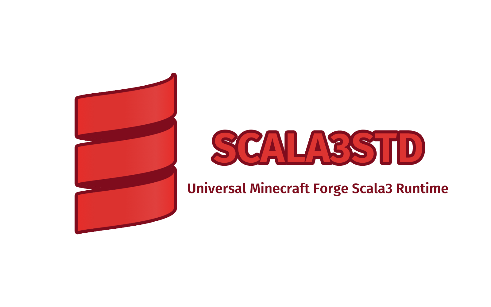

# Scala3Std

Universal Minecraft Forge Scala 3 Runtime Provider.

## Scala3Std **IS NOT A LANGUAGE ADAPTER**

### 1.13.2-

Forge has a default Scala Language Adapter, you don't need another adapter.

### Cleanroom

If you are using Cleanroom, please consider to use [CleanRoomMC/Scalar](https://github.com/CleanroomMC/Scalar) to
provide Scala language adapter.

### 1.12.2+

Add [Kotori316/SLP](https://github.com/Kotori316/SLP) to your dependencies

## How it works?

Scala3Std use shadow plugin rename `scala` to `scala3` to build a fat jar and avoid conflicting to scala used in forge.

Currently, Scala3Std is using `scala-library:2.13.15` and `scala3-library_3:3.5.1`.

## How to use

### 1.12.2

Recommend to use [GTNewHorizons/RetroFuturaGradle](https://github.com/GTNewHorizons/RetroFuturaGradle)!

Template: [Oganesson897/Templater#scala](https://github.com/Oganesson897/Templater/tree/scala)

#### 1. Declare Dependencies

```groovy
repositories {
    // ...
    maven {
        name 'Modrinth'
        url "https://api.modrinth.com/maven"
        content {
            includeGroup 'maven.modrinth'
        }
    }
    mavenCentral()
    mavenLocal() // Must be last for caching to work
}

dependencies {
    implementation "org.scala-lang:scala-library:2.13.15"
    implementation "org.scala-lang:scala3-library_3:3.5.1"

    implementation 'maven.modrinth:scala3std:3.5.1+B'
}
```

#### 2. Import and Configure shadow plugin

```groovy
import com.github.jengelman.gradle.plugins.shadow.tasks.ShadowJar

plugins {
    // ...
    id 'scala'
    id "com.github.johnrengelman.shadow" version "8.1.1"
}

compileScala {
    scalaCompileOptions.additionalParameters = ["-Xtarget", "8"] // scala/scala3#13810
}

// Use shadowJar to rename `scala` to `scala3`
tasks.named('shadowJar', ShadowJar) {
    relocate 'scala.', 'scala3.' // It should be declare more detailed for compat
    configurations = []
}

tasks.named("build") {
    dependsOn(tasks.named("shadowJar"))
}

// This task is used to make `runClient` using `shadow jar` instead of `common jar`.
tasks.register('shadowCopy', Copy) {
    mustRunAfter(tasks.named("shadowJar"))

    from 'build/libs'
    into 'build/libs'
    rename { String fileName ->
        fileName.replace('-all', '-dev')
    }
    include("*-all.jar")
}

tasks.named("jar") {
    dependsOn(tasks.named("shadowJar"))
}

tasks.named("packageMcLauncher") {
    dependsOn(tasks.named("shadowCopy"))
}
```

#### 3. Use Annotation to declare a Mod

```scala 3
@Mod(
  modid = "foo",
  name = "Foo",
  version = "1.0.0",
  modLanguage = "scala", // If you are using CleanRoom, please remember to implementation `Scalar`
)
object Foo {
  // ...
}
```

### Other Version

Just refer to 1.12.2 tutorial and shadow your mod.

Any Pull Request or Issue is welcome!

### Use a Scala 3 library

```diff
+ configurations {
+    shade
+    implementation.extendsFrom(shade)
+ }

dependencies {
	 // ...
+    shade "to.agroup:something:version"
}

tasks.named('shadowJar', ShadowJar) {
     relocate 'scala.', 'scala3.'
-    configurations = []
+    configurations = [project.configurations.shade]
}
```

## Issues

https://github.com/H2Sxxa/Scala3Std/issues

## Credits

- [Oganesson897](https://github.com/Oganesson897)
